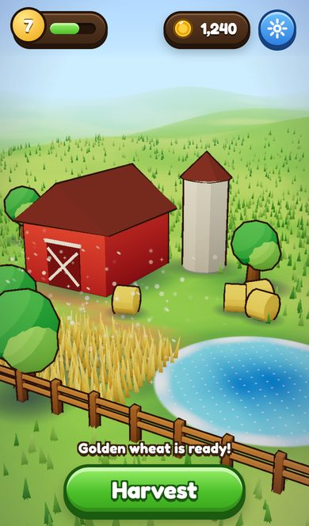

# LOOK: making a small three.js or canvas game look great on a phone

> **DIRECTION FROM CALEB (overrides the toon recipes below).** The bright cartoon look in `look-demo.html` (flat
> toon ramp, thick ink outlines, saturated primary colours, bubbly buttons) is **not** the look he wants. The target is
> the rich, detailed, warm-lit, textured look of his key art: `/home/user/claires-big-life-adventure/references/calebs_farm/ref_01.png`
> to `ref_04.png`. Read it as: golden-hour sun with long soft shadows, dense layered foliage with colour variation,
> natural (not primary) colours with warm accents, detailed props and buildings with visible materials and wear,
> deep blue water with depth, foam and shoreline, atmospheric haze toward the horizon, and UI made of dark navy glass panels,
> wood and gold trim, parchment cards and glossy icons. Kids' games can stay friendly and colourful, but with depth,
> texture and real lighting, not flat vector shapes with outlines. The toon and outline sections stay here only as
> reference for what NOT to ship. A realistic-look playbook is being written to replace them.


Status: every recipe below runs in [`look-demo.html`](look-demo.html) (a small farm, three.js r180 vendored from `HoleGrind/vendor/three`, no CDN).
Code blocks are copied verbatim from tested files (`tests/check-snippets.py` checks that). Numbers are from `tests/results/`, measured in
**Chromium 141 (SwiftShader)** and **Playwright WebKit 26.0** at the iPhone 13 profile (390x664 CSS px, DPR 3). Limits are stated in the last section.
three r180 is ES-module only: copy the demo's `<script type="importmap">` (maps `three` and `three/addons/` to `HoleGrind/vendor/three/`) and `import * as THREE from 'three'`; `mergeVertices` comes from `three/addons/utils/BufferGeometryUtils.js`. Open it: `http://localhost:8765/arcade/docs/playbook/look-demo.html` (add `?tm=aces&toon=0&outline=0&shadow=map&fog=0&grass=0` to A/B any recipe).



## Do this first (15 rules)

1. **Pick 8 to 12 colours once**, in one `PAL` object, and never type a hex in a shader again. Fewer hues read as more coherent than many ([Pav Creations](https://pavcreations.com/color-theory-for-game-art-design-the-basics/)). Use a good ratio of low to high saturation; all-intense palettes tire the eye (same source).
2. **Shift hue, do not just darken.** Shadows go cool (blue/violet), lights go warm (yellow); this is the standard hue-shifting advice in the palette guides that came up in search ([Pixune](https://pixune.com/blog/color-theory-in-game-art-basics-and-complementary/), [Blue Canary](https://www.blue-canary.net/miniature-painting/painting-tips-and-guides/hue-shifting/); search snippets only, not fetched). In the demo the hemisphere light's *ground* colour is purple, which is what tints the toon shadows.
3. **Toon = `MeshToonMaterial` + a 3-band ramp**, `NearestFilter`, `NoColorSpace` ([three.js docs](https://threejs.org/docs/pages/MeshToonMaterial.html)). Two to three light bands is also what Breath of the Wild's look reduces to ([recap](https://www.vfxapprentice.com/blog/cel-shading-video-games-zelda), search snippet).
4. **Ink outline = inverted hull** ([moonjump](https://moonjump.com/game-dev-mechanics-toon-shading-cel-shading-how-it-works/)), but weld the outline copy's normals or box corners crack, and push in clip space so the line is a constant pixel width.
5. **Tone map on purpose.** Measured mean saturation on the same scene: AgX 0.402, ACES 0.508, no tone mapping 0.545, Neutral 0.663 (`img/look-tonemap-sheet.jpg`; saturation is a proxy, I also judged the four by eye). For a bright toon palette use ACES or Neutral; keep AgX for realistic PBR. The demo defaults to ACES.
6. **Fog colour must equal the sky's horizon colour, and the sky must skip tone mapping.** Fog is applied after tone mapping. A tone-mapped sky was 29 levels off the fog colour at the horizon (visible band); an un-tone-mapped sky was 0 off.
7. **Custom `ShaderMaterial` must include `tonemapping_fragment`, `colorspace_fragment`, `fog_pars_*` and `fog_*`**, each `#include` alone on its own line and never followed by `}` on the same line (both mistakes broke shaders while building the demo).
8. **Never draw a black shadow.** Baked radial-alpha blob, tinted `#2c2452`, `depthWrite:false`, 0.5 opacity. Measured share of near-black pixels in the finished frame: 0.
9. **At most one shadow map**, tight frustum, and only if the blob is not enough. It re-draws every caster: true GPU draws went 29 to 38; `renderer.info.render.calls` did not count that pass (29).
10. **Bake AO into vertex colours** (dark at the base, light at the top) and darken the ground under every prop. Free, and it makes props sit down.
11. **Instance everything repeated.** Fences, trees, hay, wheat and the grass field are one draw call each: the whole scene is 76424 triangles in 40 GPU draws. Utsubo's mobile target is about 100 per frame ([tip 30](https://www.utsubo.com/blog/threejs-best-practices-100-tips)).
12. **Cap DPR at 2** ([Utsubo](https://www.utsubo.com/blog/threejs-best-practices-100-tips)) and **turn MSAA off on mobile WebGL** ([Bugnet](https://bugnet.io/blog/how-to-fix-unity-webgl-build-crashing-on-safari-ios); the demo turns it off at DPR 2+, my heuristic, not measured on a device). Canvas at 390x664 CSS px: 0.26 MP at 1x, 1.04 MP at 2x, 2.33 MP at 3x. A 390x844 full-screen game is 1.32 MP at 2x and 2.96 MP at 3x.
13. **No post-processing by default.** Fake glow with additive sprites and `toneMapped:false`; if you add bloom, run it at half resolution.
14. **Type and UI:** Fredoka or Baloo 2 (both OFL), 3D-bottom buttons, dark outline made of `text-shadow`, tap targets 44 px+, `env(safe-area-inset-*)` padding.
15. **Judge it on a phone-shaped screenshot**, not the desktop window. Diff two captures (this file does it with `window.__frameStats()`), never "it looks fine".

## 1. Palette

The demo palette (11 swatches: `?pal=1` shows them): sky `#3f9bff`/horizon `#cdeeff`, grass `#72c23a`/`#a0d846`, dirt `#c08a52`, barn `#d9483b`, roof `#7d3d33`, hay `#f2c744`, leaves `#3fae4a`, water `#1d6cc0`, shadow `#2c2452`, ink `#3b2412`.
Use complementary pairs (red barn on green field) for the hero object and analogous colours for the background ([Pav Creations](https://pavcreations.com/color-theory-for-game-art-design-the-basics/)). Breath of the Wild balanced information density against readability and simplified shapes on purpose ([GDC 2017 recap](https://www.thumbsticks.com/gdc17-designing-zelda-breath-of-the-wild/)).

## 2. Toon ramp

<!-- from look-demo.html -->
```js
const ramp = (() => { const n = 16, d = new Uint8Array(n); for (let i = 0; i < n; i++) { const dot = ((i + 0.5) / n) * 2 - 1; d[i] = dot < 0.1 ? 128 : dot < 0.55 ? 205 : 255; }
  const t = new THREE.DataTexture(d, n, 1, THREE.RedFormat); t.minFilter = t.magFilter = THREE.NearestFilter; t.generateMipmaps = false; t.needsUpdate = true; return t; })();
```
Tested: builds in both engines, 0 shader errors. Toon vs standard material on the same scene: mean saturation 0.508 vs 0.517 (little change; the win is the readable light bands on rounded props such as the silo).

## 3. Outlines (inverted hull, constant pixel width)

<!-- from look-demo.html -->
```js
const OU = { uPx: { value: 2.2 * dpr }, uRes: { value: new THREE.Vector2(1, 1) } };
const outlineMat = new THREE.MeshBasicMaterial({ color: PAL.ink, side: THREE.BackSide, fog: true });
outlineMat.onBeforeCompile = sh => { Object.assign(sh.uniforms, OU);
  sh.vertexShader = sh.vertexShader.replace('#include <common>', '#include <common>\nuniform float uPx; uniform vec2 uRes;')
    .replace('#include <project_vertex>', `#include <project_vertex>
      vec3 on = normal;
      #ifdef USE_INSTANCING
        on = mat3(instanceMatrix) * on;
      #endif
      vec2 dir = normalize((projectionMatrix * vec4(normalMatrix * on, 0.0)).xy * uRes);
      gl_Position.xy += dir * (2.0 * uPx / uRes) * gl_Position.w;`); };
const smooth = g => { const s = g.clone(); s.deleteAttribute('normal'); s.deleteAttribute('uv'); const m = mergeVertices(s, 1e-3); m.computeVertexNormals(); return m; };   // box corners must share one normal or the hull cracks
```
The `smooth()` copy matters: `BoxGeometry` has split normals, so extruding along them opens gaps at corners. Cost measured: draws 40 with outlines vs 31 without, triangles 76424 vs 73748. The moonjump article lists the same limits: silhouette only, one extra draw per object, depends on normals ([source](https://moonjump.com/game-dev-mechanics-toon-shading-cel-shading-how-it-works/)). Screen-space edge detection (depth + normal post pass, e.g. [three-js-toon-shader](https://github.com/manbust/three-js-toon-shader), repo blurb from search, not fetched) also draws inner edges but costs a full-screen pass; not used here.

## 4. Tone mapping and colour grading

| tone mapping (WebKit 26.0, same scene) | mean saturation | mean luma |
|---|---|---|
| AgX | 0.402 | 0.637 |
| ACES Filmic (demo default) | 0.508 | 0.665 |
| Khronos Neutral | 0.663 | 0.617 |
| Linear / none | 0.545 | 0.645 |

Chromium gives the same numbers within 0.001. Contact sheets: `img/look-tonemap-sheet.jpg`, `img/look-flags-sheet.jpg` (standard material, no outline, no shadows, shadow map, map + blobs). AgX is Blender 4's default and gives a more natural, flatter start ([issue #27362](https://github.com/mrdoob/three.js/issues/27362)); on this bright palette it looked washed out. Grade cheaply by choosing palette values and `toneMappingExposure` (1.0 here). A CSS `filter: saturate()` on the canvas costs an extra composite pass; avoid on phones. Set `toneMapped:false` on sky, glow and cloud sprites, or pure white renders as grey.

## 5. Sky, fog and HDR

<!-- from look-demo.html -->
```js
const sky = new THREE.Mesh(new THREE.SphereGeometry(300, 24, 12), new THREE.ShaderMaterial({
  side: THREE.BackSide, depthWrite: false, fog: false, toneMapped: SKYTM,
  uniforms: { uTop: { value: new THREE.Color(PAL.skyTop) }, uHor: { value: horizon }, uSun: { value: new THREE.Vector3(-0.5, 0.62, 0.42).normalize() }, uSunCol: { value: new THREE.Color(PAL.sun) } },
  vertexShader: 'varying vec3 vD; void main(){ vec4 w = modelMatrix*vec4(position,1.0); vD = w.xyz - cameraPosition; gl_Position = projectionMatrix*viewMatrix*w; }',
  fragmentShader: `uniform vec3 uTop,uHor,uSun,uSunCol; varying vec3 vD;
    void main(){ vec3 d = normalize(vD); float h = clamp(d.y,0.0,1.0); vec3 c = mix(uHor,uTop,pow(h,0.5));
      float s = max(dot(d,uSun),0.0); c += uSunCol*(pow(s,900.0)*3.0 + pow(s,10.0)*0.18);
      gl_FragColor = vec4(c,1.0);
      ${SKYTM ? '#include <tonemapping_fragment>' : ''}
      #include <colorspace_fragment>
    }`,
}));
sky.renderOrder = -10; sky.frustumCulled = false; scene.add(sky);
```
The sun term goes above 1.0 (an HDR value) and is clipped by the display; that is fine because the sky skips tone mapping. Fog: `new THREE.Fog(horizon, 42, 130)` uses the *same* `Color` object as the sky's `uHor`. Probe (`window.__horizon()`, `tests/results/look-probe.json`): horizon pixel sky = fog = sRGB [205, 238, 255] with the sky un-tone-mapped; [210, 221, 226] against fog [205, 238, 255] when it is tone-mapped. Do not use a `.hdr` equirect for the visible sky on phones: it is 1 to 2 MB and cannot match fog exactly; use one only for reflections (PMREM) on shiny props.

## 6. Shadows and AO

<!-- from look-demo.html -->
```js
const blobTex = (() => { const s = 128, cv = Object.assign(document.createElement('canvas'), { width: s, height: s }), x = cv.getContext('2d'), g = x.createRadialGradient(s / 2, s / 2, 0, s / 2, s / 2, s / 2);
  g.addColorStop(0, 'rgba(255,255,255,1)'); g.addColorStop(0.55, 'rgba(255,255,255,.55)'); g.addColorStop(1, 'rgba(255,255,255,0)'); x.fillStyle = g; x.fillRect(0, 0, s, s);
  const t = new THREE.CanvasTexture(cv); t.colorSpace = THREE.SRGBColorSpace; return t; })();
const blobMat = new THREE.MeshBasicMaterial({ map: blobTex, color: PAL.shadow, transparent: true, opacity: 0.5, depthWrite: false, polygonOffset: true, polygonOffsetFactor: -2, fog: true });
const blobs = [], blob = (x, z, w, d, op = 1) => { if (SHADOW !== 'blob' && SHADOW !== 'both') return; const m = new THREE.Mesh(new THREE.PlaneGeometry(w, d), blobMat); m.rotation.x = -Math.PI / 2; m.position.set(x, 0.02, z); m.renderOrder = 1; scene.add(m); blobs.push(m); };
```
<!-- from look-demo.html -->
```js
const bakeAO = (geo, { y0 = 0, y1 = 1.2, low = 0.55, tint = new THREE.Color(PAL.shadow) } = {}) => {
  const p = geo.attributes.position, col = new Float32Array(p.count * 3), c = new THREE.Color();
  for (let i = 0; i < p.count; i++) { const t = THREE.MathUtils.smoothstep(p.getY(i), y0, y1); c.set(1, 1, 1).lerp(tint, (1 - t) * (1 - low)); c.toArray(col, i * 3); }
  geo.setAttribute('color', new THREE.BufferAttribute(col, 3)); return geo; };
```
Blob mode adds 11 draws to the frame (`shadow=blob` 40 vs `shadow=none` 29 reported by `info`). The shadow map alone (`shadow=map`) draws the barn's long shadow, at the price of a second pass over every caster. Ground AO is baked into the ground's vertex colours around each footprint (`FOOT` list). Ready-made contact-shadow render-target technique: [three.js example](https://threejs.org/examples/webgl_shadow_contact.html) (search result, not fetched).

## 7. Instancing and wind (grass, crops)

<!-- from look-demo.html -->
```js
const bladeMat = (h, lo = 0.42) => { const m = new THREE.MeshBasicMaterial({ side: THREE.DoubleSide, fog: true });
  m.onBeforeCompile = sh => { sh.uniforms.uTime = WIND.uTime;
    sh.vertexShader = sh.vertexShader.replace('#include <common>', '#include <common>\nuniform float uTime; varying float vH;')
      .replace('#include <begin_vertex>', `#include <begin_vertex>
        vH = clamp(position.y / ${h.toFixed(2)}, 0.0, 1.0); vec3 ip = vec3(instanceMatrix[3]);
        float w = sin(uTime*1.7 + ip.x*0.55 + ip.z*0.35)*0.6 + sin(uTime*3.1 + ip.x*1.7 + ip.z*1.1)*0.25;
        transformed.x += w * vH*vH * 0.30; transformed.z += w * vH*vH * 0.12;`);
    sh.fragmentShader = sh.fragmentShader.replace('#include <common>', '#include <common>\nvarying float vH;').replace('#include <color_fragment>', '#include <color_fragment>\n diffuseColor.rgb *= mix(' + lo.toFixed(2) + ', 1.2, vH);'); };
  return m; };
```
One `InstancedMesh` of 6000 three-blade clumps: 18,000 triangles, 1 draw (`grass=0` removes 58424 vs 76424 triangles). Wind is a two-sine sway weighted by height squared, phase from the instance position, so no per-blade JS. Base dark to tip light is the cheap fake AO/gradient. Same idea as [Codrops](https://tympanus.net/codrops/2025/02/04/how-to-make-the-fluffiest-grass-with-three-js/) (sine wind, scrolling noise, chunked instancing, 1M instances) and [Smyth](https://smythdesign.com/blog/stylized-grass-webgl/) (5-vertex blades, vertex colour drives sway). Their extras (chunking, LOD) are for far bigger fields than a phone should draw.

## 8. Water

Fragment-only (`look-demo.html`, search `const water`): two sine ripples, a high-frequency sparkle term, a foam ring near the shore, alpha edge. It includes the tone-map, colour-space and fog chunks. No render targets, no reflection, one draw. Refraction/reflection passes are not worth it on a phone.

## 9. Glow, bloom fakes and particles

A camera-facing sprite with an additive radial gradient (`halo`) is the sun glow; soft white puffs are the clouds. Particles: one `THREE.Points` with a 2x2 sprite atlas (dot, glow, star, petal) and a cell index attribute, 140 points, 1 draw. Point size is clamped to the driver limit: `ALIASED_POINT_SIZE_RANGE` max was 1023 in Chromium/SwiftShader but only 256 in Playwright WebKit (`tests/results/iphone.json`); a real iPhone may differ, so clamp to `Math.min(range[1], 96)` as the demo does.

## 10. Post-processing budget for iPhone

Fill cost is passes x pixels: on a 390x844 screen one full-screen pass is 1.32 MP at DPR 2 and 2.96 MP at DPR 3 (`IPhone.canvasMB`, see `IPHONE.md`). Rules from the sources: half-resolution post "roughly doubles frame rate", disable renderer MSAA when using post, merge effects into shared passes, keep to about 100 draws ([Utsubo](https://www.utsubo.com/blog/threejs-best-practices-100-tips)); for WebGL on iOS keep post to bloom and tone mapping and avoid float buffers ([Bugnet](https://bugnet.io/blog/how-to-fix-unity-webgl-build-crashing-on-safari-ios)). Worth it: tone mapping (free, in the material shader), a CSS vignette (`#vig`, one gradient div), additive halos. Not worth it: SSAO, DOF, motion blur, full-res bloom. **Not measured:** actual iPhone GPU time; this box renders in software.

## 11. UI kit and type

<!-- from look-demo.html -->
```css
.big{pointer-events:auto;min-width:230px;min-height:64px;padding:8px 28px;border-radius:32px;border:4px solid #1b5a10;background:linear-gradient(#9cf06a,#4cc02a 55%,#39a51c);box-shadow:inset 0 5px 0 rgba(255,255,255,.5),inset 0 -5px 0 rgba(0,0,0,.15),0 6px 0 #1b5a10,0 12px 18px rgba(0,0,0,.28);color:#fff;font:700 30px/1 Fredoka,system-ui,sans-serif;text-shadow:0 -2px 0 #1b5a10,0 2px 0 #1b5a10,-2px 0 0 #1b5a10,2px 0 0 #1b5a10,-2px -2px 0 #1b5a10,2px -2px 0 #1b5a10,-2px 2px 0 #1b5a10,2px 2px 0 #1b5a10,0 4px 0 #1b5a10;touch-action:manipulation}
```
Chunky rounded face: Fredoka (used here, self-hosted in `assets/fonts/`) or Baloo 2, both OFL ([font guide](https://freebies.fluxes.com/blog/best-fonts-for-mobile-game-ui/)). A game repo's note says Baloo 2 ships tabular digits (`tnum`) while Fredoka and Lilita One do not, so use Baloo 2 for fast-changing scores ([PR note](https://github.com/Mohith26/sideout/pull/10), search snippet, not fetched). Outline text with a ring of `text-shadow` (works everywhere) plus a bottom shadow for depth. Buttons: light top highlight (`inset`), dark bottom "lip", `:active` moves down 3 px. Icons: inline SVG with 2.5 to 3 px strokes so they match the type weight (the demo's coin and gear are hand-written SVG). Licences the project already allows for icons and art: CC0 (Kenney, Quaternius, Poly Haven, ambientCG), OFL fonts, ISC/MIT icons such as Lucide, CC-BY only with credits in a `LICENSES.md` (`scratchpad/QUALITY_GATE.md`); the Claire builds used real Fluent 3D icons and one display face and the critic still called the UI "one skin" as a strength (`claire_r2_critic.md`, D). HUD in `env(safe-area-inset-*)` padding. Keep three things on screen: level, coins, one primary button.

## 12. How Poki and CrazyGames present games

- Land the player in play at once (CrazyGames: "a maximum of 1 click"), no splash screens, few menus, skippable cutscenes, visual tutorials ([CrazyGames](https://docs.crazygames.com/requirements/gameplay/), [Poki](https://developers.poki.com/guide/requirements-quality)).
- Must read from 800x450 mobile to 1920x1080 desktop; scale a 16:9 game to 640x360, 836x470 or 1031x580 (same pages). Custom fullscreen buttons are not allowed on CrazyGames.
- Mobile homepage on CrazyGames needs an initial download of 20 MB or less, 250 MB total, 20 s to gameplay ([technical](https://docs.crazygames.com/requirements/technical/)). Their launch test wants 10+ minutes average play, 10-15% day-1 return and under 10 s loading ([metrics](https://docs.crazygames.com/resources/basic-launch-metrics/)).
- The arcade's own tiles follow the same rule: key art from a real frame, HUD cropped out, one shared grade (saturation 1.3, contrast 1.1, vignette), a heavy-outlined Fredoka logotype, 480x300 plus 960x600 for big tiles (`qa/portal/NOTES.md`, `tools/keyart.py`).
- Poki blocks external requests and wants `localStorage` wrapped in try/catch (incognito); CrazyGames sets DPR to 1 on iOS and low-memory Android (both pages above).

## 13. What makes it look cheap

Pure-black shadows; a grey (tone-mapped) sky at the horizon; a single green with no hue variation; outlines that vary with distance; box corners cracking in the outline; flat white UI text without an outline; UI that ignores the notch; blob quads with a hard edge (fix: alpha falls to 0 at the edge; `darkShare` measured 0); glow that turns white to grey; wind that moves every blade in unison (use phase from position). The Claire critics found the same class of faults in this project: blobs that rendered as solid black squares, cylinder bales, a slab for a ship (`scratchpad/claire_r3_critic/REPORT.md`, `claire_r5_critic/REPORT.md`).

## Tested, and what was not

| Recipe | Chromium 141 | WebKit 26.0 | Result |
|---|---|---|---|
| Whole demo loads, 0 shader errors, 0 console errors | yes | yes | `tests/results/look-default.json` |
| Tone-mapper A/B, flags A/B, draw counts | yes | yes | `tests/results/look-matrix.json`, `look-probe.json` |
| Sky/fog seam probe | yes | yes | identical in both |
| Tap Harvest: squash, coins fly, number pop, counter +30 | yes | yes | `look-interact.json` |
| Landscape 664x390 and 320x568 layout | not run | screenshot only | `img/look-landscape-and-320.jpg`, checked by eye |

**Not verified:** any real iPhone GPU frame time, thermal behaviour, colour on an OLED panel, or the look under iOS's own tone/brightness handling. Chromium here uses SwiftShader and WebKit uses a software GL too, so both engines agreed to the pixel; that proves the code, not the speed.

## Sources used

three.js docs ([MeshToonMaterial](https://threejs.org/docs/pages/MeshToonMaterial.html), [WebGLRenderer](https://threejs.org/docs/pages/WebGLRenderer.html)), [moonjump](https://moonjump.com/game-dev-mechanics-toon-shading-cel-shading-how-it-works/), [Codrops grass](https://tympanus.net/codrops/2025/02/04/how-to-make-the-fluffiest-grass-with-three-js/), [Smyth grass](https://smythdesign.com/blog/stylized-grass-webgl/), [Utsubo 100 tips](https://www.utsubo.com/blog/threejs-best-practices-100-tips), [three.js AgX issue](https://github.com/mrdoob/three.js/issues/27362), [GDC BotW recap](https://www.thumbsticks.com/gdc17-designing-zelda-breath-of-the-wild/), [Pav Creations](https://pavcreations.com/color-theory-for-game-art-design-the-basics/), [fonts guide](https://freebies.fluxes.com/blog/best-fonts-for-mobile-game-ui/), [Bugnet iOS WebGL](https://bugnet.io/blog/how-to-fix-unity-webgl-build-crashing-on-safari-ios), [Poki](https://developers.poki.com/guide/requirements-quality), CrazyGames ([gameplay](https://docs.crazygames.com/requirements/gameplay/), [technical](https://docs.crazygames.com/requirements/technical/), [metrics](https://docs.crazygames.com/resources/basic-launch-metrics/)).
