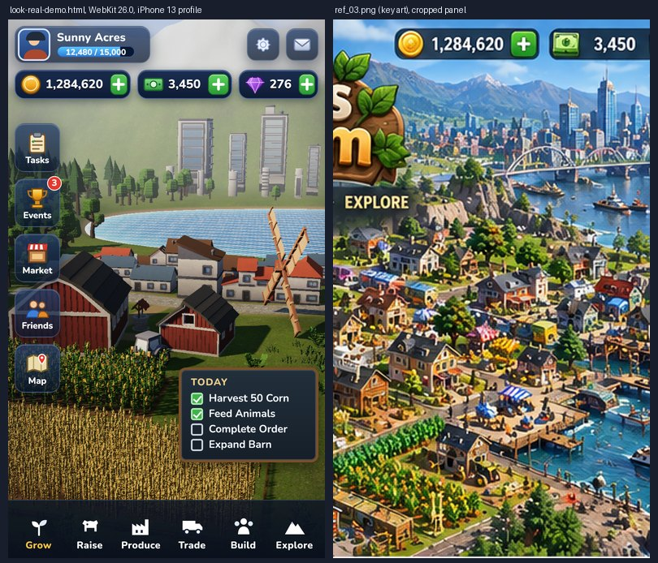

# LOOK_REALISTIC: a warm, textured, PBR farm look on the iPhone budget

Target: the key art in `/home/user/claires-big-life-adventure/references/calebs_farm/ref_01.png` to `ref_04.png` (rich, detailed, warm-lit, textured; not toon).
Everything below runs in [`look-real-demo.html`](look-real-demo.html): three.js r180 vendored (no CDN), CC0 textures and models recorded in [`real-assets/LICENSES.md`](real-assets/LICENSES.md).
Code blocks are copied verbatim from that file (`tests/check-snippets.py` checks it). Numbers come from `tests/results/real.json` (Chromium 141 and Playwright WebKit 26.0, iPhone 13 profile, run through `slot.sh`).
Open it: `http://localhost:8765/arcade/docs/playbook/look-real-demo.html` with `?ui=hud|sheet|title|none`, `?tm=aces|agx|neutral`, `?shadow=0`, `?foliage=0`, `?fog=0`, `?cam=0|1`, `?still=1`.



**Honest verdict:** it now has the right *ingredients* (real light, texture, haze, water depth, dense instanced foliage, kit buildings, navy-glass UI) but it is a clean low-poly diorama, not the painterly, hand-dressed density of the key art. The list of what is still missing is at the end. Read it before promising Caleb "the same look".

## What the key art actually is (read from ref_01 to ref_04)

- **Camera:** a high three-quarter view, about 35 to 45 degrees down, long lens, so everything is small and dense; the horizon carries mountains, a city skyline and a bay.
- **Light:** warm sun from the left, long soft shadows, bluish haze toward the distance, bright but not blown out; the shadow side stays blue-green, not black.
- **Colour:** natural greens (olive to emerald), gold wheat, red barn, terracotta roofs, deep blue water with turquoise shallows and white foam. Saturated, but no primaries.
- **Detail:** hundreds of distinct props; roofs, wood and stone show grain and wear; crops are in visible rows; trees overlap in layers with colour variation.
- **UI:** dark navy glass panels with a light rim, gold and wood trim, cream parchment cards with rendered icons, glossy green "+" and "Ship" buttons, a currency bar with coin, cash and gem, a chalkboard task list, a left rail of icon tiles, a dark bottom bar with white icons and labels.

## Do this first (15 rules)

1. **PBR only:** `MeshStandardMaterial`, metalness 0, roughness 0.8 to 0.96 for ground and foliage. No toon ramp, no outlines.
2. **Real textures, small:** ambientCG CC0 colour + normal maps at 512 px WebP (0.8 MB on disk for all of them; about 9.3 MB of GPU memory with mipmaps). KTX2 needs an extra loader and a Basis wasm; WebP is enough at this size.
3. **One terrain material, world-space splat:** grass, meadow, path, paving, furrowed soil, rock and snow are blended in the fragment shader from world position and slope, so there is no texture stretching and no per-tile draw call.
4. **Light like the art:** one warm low sun (`#ffe2b6`, 3.1) with a 2048 shadow map, a hemisphere light (sky blue over warm brown), and image-based light rendered from the same sky (`PMREMGenerator.fromScene`, intensity 0.55).
5. **Tone mapping:** ACES Filmic, exposure 1.0. On this scene ACES gave a mean saturation of 0.415 and AgX 0.361 (`?tm=agx`); AgX greys the greens, so ACES it is.
6. **Haze = the sky's horizon colour.** `FogExp2(HORIZON, 0.005)` and a sky shader that does not tone-map. Measured at the horizon pixel: sky [217, 223, 230], fog colour [217, 223, 230].
7. **Bake AO into vertex colours** on every kit model (dark at the base, light at the top) and around building footprints on the ground.
8. **Kits arrive in the wrong palette.** Kenney's nature kit is teal-green and unlit. Re-map by material name to natural colours (table in the code) and convert to `MeshStandardMaterial`. A kit's one green roof colour becomes terracotta, slate or brown with a 3-line fragment patch (`reroof()`); do it in the shader, because a canvas copy of the palette rendered black in WebKit.
9. **Break flat colour:** multiply albedo by world-space grey noise and bump the normal with it (frequency about 3.2 per metre for leaves, 0.55 for walls). Low-poly canopies read as leafy.
10. **Instance everything repeated,** one `InstancedMesh` per species and material, per-instance colour jitter through `setColorAt`. Static-batch buildings with `mergeGeometries`, so the whole village is a draw or two.
11. **Quantized (gltfpack) GLBs must be converted to Float32 before you scale or merge them** (int16 attributes clamp, and `mergeGeometries` returns null). This cost me the whole village once.
12. **Water = a height texture + a small shader:** depth gradient, shoreline foam from the same depth, sand showing through, mild sky reflection, sun glint. Keep the normals calm; strong ripples turn it into ice.
13. **Crop rows in the ground shader (furrows) plus instanced plants** on the same 0.91 m grid; the wheat is a tuft scaled 1.25x, not a field of separate stalks.
14. **UI:** navy glass (`rgba` gradient, 1 px light border, inset highlight, `backdrop-filter: blur(6px)`), gold and wood trim, parchment from a paper texture with `background-blend-mode: multiply`, tabular numerals for currency, icons **rendered from your own models** into an offscreen target.
15. **Budget it and say so:** measured 121 GPU draw calls, 348466 triangles and 9.3 MB of textures in the demo (table below). Keep the main pass under about 100 draws and 400k triangles (the shadow pass adds about half again: 74 main + 47 shadow = 121 GPU draws here); past that, cull or LOD first.

## 1. Renderer, colour and haze

<!-- from look-real-demo.html -->
```js
const renderer = new THREE.WebGLRenderer({ canvas, antialias: opt('aa', dpr >= 2 ? '0' : '1') === '1', powerPreference: 'high-performance' });
renderer.setPixelRatio(dpr);
renderer.toneMapping = { aces: THREE.ACESFilmicToneMapping, agx: THREE.AgXToneMapping, neutral: THREE.NeutralToneMapping }[TMKEY]; renderer.toneMappingExposure = +opt('exp', 1.0);
renderer.shadowMap.enabled = SHADOW; renderer.shadowMap.type = THREE.PCFSoftShadowMap;
const shaderErrors = []; renderer.debug.onShaderError = (gl, prog, vs, fs) => shaderErrors.push((gl.getShaderInfoLog(vs) || '') + (gl.getShaderInfoLog(fs) || ''));
const scene = new THREE.Scene(), camera = new THREE.PerspectiveCamera(46, 1, 0.5, 900);
const HORIZON = new THREE.Color('#d9dfe6'), TOP = new THREE.Color('#5f8fd0');            // the sky and the fog share these colours
if (FOG) scene.fog = new THREE.FogExp2(HORIZON, 0.005);                                   // haze: about 22% at 100 m, 63% at 200 m
```
The sky dome is the toon demo's shader plus soft clouds (a 4-octave value-noise fbm on the projected view direction); it is the only surface that skips tone mapping, exactly as in `LOOK.md` section 5. HORIZON `#d9dfe6` and TOP `#5f8fd0` are shared by the sky, the fog and the water reflection.

## 2. Light

<!-- from look-real-demo.html -->
```js
const sun = new THREE.DirectionalLight('#ffe2b6', 3.4); sun.position.copy(SUN_DIR).multiplyScalar(60); sun.target.position.set(0, 0, -6); scene.add(sun, sun.target);
if (SHADOW) { sun.castShadow = true; sun.shadow.mapSize.set(2048, 2048); const c = sun.shadow.camera; c.left = -34; c.right = 34; c.top = 34; c.bottom = -34; c.near = 10; c.far = 130; sun.shadow.bias = -0.0003; sun.shadow.normalBias = 0.05; sun.shadow.radius = 3; }
scene.add(new THREE.HemisphereLight('#a9c8f5', '#6f5a3a', 0.72));
{ const pm = new THREE.PMREMGenerator(renderer), es = new THREE.Scene(); const m = sky.clone(); m.material = skyMat.clone(); m.material.uniforms.uT = { value: 0 }; es.add(m); scene.environment = pm.fromScene(es, 0.04).texture; scene.environmentIntensity = 0.55; pm.dispose(); }
```
Shadow map 2048 with a plus/minus 34 m frustum, `normalBias` 0.05, `radius` 3 (PCF soft). The frustum is tight on the farm: the mountains and skyline receive no shadow and do not need it. `?shadow=0` measures the cost.

## 3. Ground: PBR textures, world-space splat, furrows

<!-- from look-real-demo.html -->
```js
  const m = new THREE.MeshStandardMaterial({ vertexColors: true, roughness: 0.96, metalness: 0, normalMap: TX.grassN, normalScale: new THREE.Vector2(0.7, 0.7) });
  TX.grassN.repeat.set(TW / 6, TD / 6);
  m.onBeforeCompile = sh => {
    Object.assign(sh.uniforms, { uGrass: { value: TX.grass }, uMeadow: { value: TX.meadow }, uDirt: { value: TX.dirt }, uPave: { value: TX.paving }, uRock: { value: TX.rock }, uSnow: { value: TX.snow }, uRects: { value: FIELDS.map(f => new THREE.Vector4(f.x0, f.x1, f.z0, f.z1)) } });
    sh.vertexShader = sh.vertexShader.replace('#include <common>', '#include <common>\nvarying vec3 vWP; varying vec3 vWN;')
      .replace('#include <begin_vertex>', '#include <begin_vertex>\nvWP = (modelMatrix*vec4(transformed,1.0)).xyz; vWN = normal;');
    sh.fragmentShader = sh.fragmentShader.replace('#include <common>', '#include <common>\nuniform sampler2D uGrass,uMeadow,uDirt,uPave,uRock,uSnow; uniform vec4 uRects[3]; varying vec3 vWP; varying vec3 vWN;')
      .replace('#include <map_fragment>', `
        vec2 w = vWP.xz;
        vec3 g1 = texture2D(uGrass, w*0.16).rgb, g2 = texture2D(uGrass, w*0.043+7.0).rgb, mw = texture2D(uMeadow, w*0.07).rgb;
        float macro = texture2D(uMeadow, w*0.011).g;
        vec3 grass = mix(g1*vec3(0.80,1.18,0.50), g2*vec3(0.92,1.22,0.52), 0.35);
        grass = mix(grass, mw*vec3(0.95,1.05,0.62), 0.15 + 0.3*macro);
        vec3 dirt = texture2D(uDirt, w*0.22).rgb;
        vec3 pave = texture2D(uPave, w*0.30).rgb*1.15;
        float row = 0.5 + 0.5*sin(w.y*6.9);                                            // furrows run along x, 0.9 m apart
        vec3 soil = texture2D(uDirt, w*0.35).rgb*vec3(0.42,0.30,0.20)*(0.55 + 0.75*row);
        float laneZ = -14.5 + sin(w.x*0.25)*0.8, lane = (1.0-smoothstep(1.1,1.5,abs(w.y-laneZ))) * step(-14.0,w.x)*step(w.x,16.0);
        float path = (1.0-smoothstep(0.7,1.05,abs(w.x-(-1.2+sin(w.y*0.3)*1.4)))) * step(-14.5,w.y)*step(w.y,9.5);
        path = max(path, (1.0-smoothstep(0.6,0.95,abs(w.y+5.2)))*step(-8.0,w.x)*step(w.x,5.5));
        float fld = 0.0; for (int i=0;i<3;i++){ vec4 r = uRects[i]; float d = min(min(w.x-r.x, r.y-w.x), min(w.y-r.z, r.w-w.y)); fld = max(fld, smoothstep(-0.05,0.3,d)); }
        float beach = smoothstep(0.55,0.05,vWP.y)*smoothstep(-2.5,-0.1,vWP.y);
        vec3 alb = mix(grass, dirt*vec3(1.05,0.95,0.85), max(max(path*0.9, beach), (1.0-smoothstep(1.4,2.4,abs(w.y-laneZ)))*step(-14.0,w.x)*step(w.x,16.0)*0.5));
        alb = mix(alb, pave, lane); alb = mix(alb, soil, fld);
        float slope = 1.0 - clamp(normalize(vWN).y, 0.0, 1.0);
        vec3 rk = texture2D(uRock, w*0.09).rgb*1.5;
        alb = mix(alb, rk, smoothstep(0.30,0.55,slope) * step(1.5, vWP.y));
        alb = mix(alb, rk*0.8, smoothstep(0.42,0.6,slope));
        float snow = smoothstep(24.0,32.0, vWP.y + 6.0*(macro-0.5)) * smoothstep(0.7,0.35,slope);
        alb = mix(alb, texture2D(uSnow, w*0.08).rgb*1.6, snow);
        diffuseColor.rgb *= alb;`);
```
The masks (lane, path, fields, beach, slope, snow) are analytic in the fragment shader, so edges stay crisp; a vertex-weight splat at a 1.5 m mesh spacing smeared the path into brown clouds. Furrows are `sin(z * 6.9)` inside the field rectangles, which is why the instanced rows use the same 0.91 m grid.

## 4. Water with depth and foam

<!-- from look-real-demo.html -->
```js
const waterMat = new THREE.ShaderMaterial({ fog: true, uniforms: THREE.UniformsUtils.merge([THREE.UniformsLib.fog, { uH: { value: hTex }, uT: { value: 0 }, uSun: { value: SUN_DIR }, uHor: { value: HORIZON }, uTop: { value: TOP }, uBox: { value: new THREE.Vector4(TCX - TW / 2, TCZ - TD / 2, TW, TD) } }]),
  vertexShader: 'varying vec3 vP;\n#include <fog_pars_vertex>\nvoid main(){ vec4 w = modelMatrix*vec4(position,1.0); vP = w.xyz; vec4 mvPosition = viewMatrix*w; gl_Position = projectionMatrix*mvPosition;\n#include <fog_vertex>\n}',
  fragmentShader: `uniform sampler2D uH; uniform float uT; uniform vec3 uSun,uHor,uTop; uniform vec4 uBox; varying vec3 vP;
    #include <fog_pars_fragment>
    float wv(vec2 p){ return sin(p.x*3.1+uT*0.9)*0.5+sin(p.y*4.3-uT*1.2)*0.35+sin((p.x+p.y)*7.3+uT*1.7)*0.25+sin((p.x-p.y)*13.0-uT*2.1)*0.12; }
    void main(){
      vec2 uv = (vP.xz - uBox.xy)/uBox.zw; float ground = texture2D(uH, uv).r*9.0 - 6.0; float depth = max(0.0, -ground);
      vec2 q = vP.xz*0.55; vec3 n = normalize(vec3(-(wv(q+vec2(.1,0.))-wv(q))*1.3, 1.0, -(wv(q+vec2(0.,.1))-wv(q))*1.3));
      vec3 V = normalize(cameraPosition - vP); vec3 R = reflect(-V, n);
      float fres = 0.04 + 0.96*pow(1.0-clamp(dot(V,n),0.0,1.0),5.0);
      vec3 refl = mix(uHor*0.85, uTop, pow(clamp(R.y,0.0,1.0),0.45)); refl += vec3(1.0,0.8,0.5)*pow(max(dot(R,normalize(uSun)),0.0),120.0)*2.4;
      float k = 1.0-exp(-depth*0.55);
      vec3 col = mix(vec3(0.10,0.55,0.62), vec3(0.015,0.10,0.30), k);                     // turquoise shallows to deep navy
      col = mix(col, vec3(0.60,0.60,0.46), (1.0-smoothstep(0.0,0.5,depth))*0.55);        // sand showing through
      col = mix(col, refl, clamp(fres*0.75,0.0,0.6));
      float sh = depth + 0.12*wv(vP.xz*1.7 + uT*0.4); float foam = (1.0-smoothstep(0.02,0.42,sh)) * (0.55+0.45*sin(depth*22.0 - uT*2.2 + wv(vP.xz*2.0)*3.0));
      foam += (1.0-smoothstep(0.0,0.10,depth))*0.8; col = mix(col, vec3(0.97,0.98,0.96), clamp(foam,0.0,1.0)*0.9);
      gl_FragColor = vec4(col,1.0);
      #include <tonemapping_fragment>
      #include <colorspace_fragment>
      #include <fog_fragment>
```
The depth comes from a 256 x 256 R8 texture of the terrain height, so shallows, sand and foam follow the real shoreline. It includes the tone-map, colour-space and fog chunks (`LOOK.md` rule 7).

## 5. Kits: recolour, bake AO, roughen

<!-- from look-real-demo.html -->
```js
const RECOLOUR = { leafsGreen: '#4f7f2b', leafsDark: '#2f5a2c', leafsFall: '#c98a2e', leafs: '#4f7f2b', woodBark: '#5f4630', woodBarkDark: '#4b3828', grass: '#5c8a34', dirt: '#8a8072', corn: '#e8b93a', colorRed: '#c23a30', colorYellow: '#e8c23a', colorPurple: '#8a4bb0', woodInner: '#d8b45a', _defaultMat: '#e2b85a', wood: '#7a5a3a', stone: '#8d8a84' };
const FOLIAGE_MATS = /^(leafs|grass|corn|colorRed|colorYellow|colorPurple|woodInner|_defaultMat)/;
```
<!-- from look-real-demo.html -->
```js
const ROOFS = ['#b5533a', '#4f6a8a', '#6b4a34'];                                              // terracotta, slate blue, brown
function reroof(m, hex) {                                                                   // kit palettes have one green roof: swap green-dominant texels for another colour, keep the shading
  const prev = m.onBeforeCompile, col = new THREE.Color(hex);
  m.onBeforeCompile = sh => { prev(sh); sh.uniforms.uRoof = { value: col }; sh.fragmentShader = sh.fragmentShader.replace('#include <common>', '#include <common>\nuniform vec3 uRoof;').replace('#include <map_fragment>', '#include <map_fragment>\n { vec3 c0 = diffuseColor.rgb; if (c0.g > c0.r*1.2 && c0.g > c0.b*1.2) diffuseColor.rgb = uRoof*(0.55 + 1.3*dot(c0, vec3(0.3,0.59,0.11))); }'); };
  const key = m.customProgramCacheKey; m.customProgramCacheKey = () => key.call(m) + 'roof'; return m; }
```
<!-- from look-real-demo.html -->
```js
async function kit(name, { h, w, key = name }) {                                          // returns [{geometry, material}] scaled to the target height (h) or width (w), base on y = 0, centred on x/z
  if (KITS[name + h + w]) return KITS[name + h + w];
  const gltf = await gl.loadAsync(`real-assets/models/${name}.glb`); gltf.scene.updateMatrixWorld(true); const parts = []; const box = new THREE.Box3().setFromObject(gltf.scene), sz = box.getSize(new THREE.Vector3());
  const s = h ? h / sz.y : w / Math.max(sz.x, sz.z), ctr = box.getCenter(new THREE.Vector3());
  gltf.scene.traverse(o => { if (!o.isMesh) return; const g = toFloat(o.geometry.clone()); g.applyMatrix4(o.matrixWorld); g.translate(-ctr.x, -box.min.y, -ctr.z); g.scale(s, s, s);
    g.deleteAttribute('uv1'); const pos = g.attributes.position, hh = sz.y * s, col = new Float32Array(pos.count * 3);                   // vertex-colour AO: dark at the base, light at the top
    for (let i = 0; i < pos.count; i++) { const t = sstep(0, Math.max(0.6, hh * 0.85), pos.getY(i)), a = 0.5 + 0.5 * t, ta = 0.94 + 0.06 * t; col.set([a * 1.0, a * 0.97, a * ta * 0.92 + (1 - a) * 0.0], i * 3); }
    g.setAttribute('color', new THREE.BufferAttribute(col, 3)); parts.push({ geometry: g, material: stdOf(o.material, key.startsWith('sky') || key.startsWith('low') ? key.split('_')[0] : key) }); });
  return (KITS[name + h + w] = parts); }
```
`detail()` (in the file) is the world-space grunge-plus-bump patch; `stdOf()` picks foliage, crop or wall settings by material name.

## 6. Dense foliage and crops with instancing

<!-- from look-real-demo.html -->
```js
function instances(parts, mats, { jitter = 0.12, hue = 0, castShadow = true } = {}) {                                  // one InstancedMesh per material, per-instance colour variation
  const out = []; for (const { geometry, material } of parts) { const im = new THREE.InstancedMesh(geometry, material, mats.length); const c = new THREE.Color();
    mats.forEach((m, i) => { im.setMatrixAt(i, m); c.setHSL(0, 0, 1); c.offsetHSL(hue * (rng() - 0.5), 0, (rng() - 0.5) * jitter); c.multiplyScalar(1); im.setColorAt(i, c); });
    im.instanceMatrix.needsUpdate = true; im.instanceColor.needsUpdate = true; im.castShadow = castShadow && SHADOW; im.receiveShadow = true; im.frustumCulled = false; scene.add(im); out.push(im); } return out; }
```
<!-- from look-real-demo.html -->
```js
function batch(list) {                                                                                                  // static batching: merge placed clones that share a material into one mesh
  const by = new Map(); for (const { parts, m } of list) for (const p of parts) { const g = p.geometry.clone().applyMatrix4(m); (by.get(p.material) || by.set(p.material, []).get(p.material)).push(g); }
  for (const [mat, gs] of by) { const mesh = new THREE.Mesh(mergeGeometries(gs), mat); mesh.castShadow = SHADOW; mesh.receiveShadow = true; mesh.frustumCulled = false; scene.add(mesh); } }
```
The demo places 430 trees, 180 bushes, 372 crop plants and 12 houses (plus flowers, grass tufts, rocks and fences). Trees are placed by rejection sampling (hills and forest edges dense, the meadow sparse); crops on a 0.62 x 0.91 m grid.

## 7. UI in the art's style

<!-- from look-real-demo.html -->
```css
.glass{background:linear-gradient(180deg,rgba(38,64,108,.78),var(--navy));border:1px solid var(--line);border-radius:14px;box-shadow:inset 0 1px 0 rgba(255,255,255,.18),0 6px 18px rgba(0,8,24,.45);backdrop-filter:blur(6px);-webkit-backdrop-filter:blur(6px)}
```
<!-- from look-real-demo.html -->
```css
.card{position:relative;border-radius:10px;padding:6px 4px 5px;text-align:center;color:#3b2a14;font:800 13px/1.1 Nunito;background:url(real-assets/tex/paper_c.webp) center/160px,linear-gradient(#f4e9cd,#dcc99a);background-blend-mode:multiply;border:2px solid #b89a5a;box-shadow:inset 0 0 0 1px rgba(255,255,255,.55),inset 0 -10px 18px rgba(120,80,20,.22),0 3px 6px rgba(0,0,0,.35)}
```
Parts: player plate with a level bar, three currency pills with green plus buttons, a five-tile left rail with a red badge, a chalkboard task list with wood trim, a six-item bottom bar, a wood plaque title (`?ui=title`), and a parchment bottom sheet whose crop icons are rendered from the game's own models (`?ui=sheet`):
<!-- from look-real-demo.html -->
```js
    renderer.setRenderTarget(rt); renderer.setClearColor(0x000000, 0); renderer.clear(); renderer.render(sc, ca); renderer.readRenderTargetPixels(rt, 0, 0, 160, 160, buf); renderer.setRenderTarget(null); sc.remove(g);
```
Icons are hand-written SVG. Fonts: Nunito (body, 800 weight for labels) and Fredoka (plaque), both OFL.

## Budget (measured)

| Variant | Engine | three draw calls | GPU draws | Triangles | Textures | Texture MB (est.) | Mean luma | Mean saturation | Shader errors |
|---|---|---|---|---|---|---|---|---|---|
| hud: `ui=hud` | chromium | 74 | 121 | 348,466 | 25 | 9.3 | 0.448 | 0.415 | 0 |
| hud: `ui=hud` | webkit | 74 | 121 | 348,466 | 25 | 9.3 | 0.449 | 0.415 | 0 |
| none: `ui=none` | chromium | 74 | 121 | 348,466 | 25 | 9.3 | 0.448 | 0.415 | 0 |
| none: `ui=none` | webkit | 74 | 121 | 348,466 | 25 | 9.3 | 0.449 | 0.415 | 0 |
| sheet: `ui=sheet` | chromium | 74 | 121 | 348,466 | 25 | 9.3 | 0.448 | 0.415 | 0 |
| sheet: `ui=sheet` | webkit | 74 | 121 | 348,466 | 25 | 9.3 | 0.449 | 0.415 | 0 |
| land: `ui=hud` | chromium | 74 | 121 | 348,466 | 25 | 9.3 | 0.354 | 0.451 | 0 |
| land: `ui=hud` | webkit | 74 | 121 | 348,466 | 25 | 9.3 | 0.354 | 0.451 | 0 |
| noshadow: `ui=none&shadow=0` | chromium | 74 | 74 | 348,466 | 24 | 9.3 | 0.462 | 0.42 | 0 |
| noshadow: `ui=none&shadow=0` | webkit | 74 | 74 | 348,466 | 24 | 9.3 | 0.463 | 0.42 | 0 |
| nofoliage: `ui=none&foliage=0` | chromium | 25 | 47 | 88,080 | 25 | 9.3 | 0.453 | 0.414 | 0 |
| nofoliage: `ui=none&foliage=0` | webkit | 25 | 47 | 88,080 | 25 | 9.3 | 0.453 | 0.413 | 0 |
| ctxloss: `ui=none` | chromium | 74 | 121 | 348,466 | 25 | 9.3 | 0.448 | 0.415 | 0 |
| ctxloss: `ui=none` | webkit | 74 | 121 | 348,466 | 25 | 9.3 | 0.449 | 0.415 | 0 |
| title: `ui=title` | webkit | 74 | 121 | 348,466 | 25 | 9.3 | 0.449 | 0.415 | 0 |
| agx: `ui=none&tm=agx` | webkit | 74 | 121 | 348,466 | 25 | 9.3 | 0.469 | 0.361 | 0 |
| nofog: `ui=none&fog=0` | webkit | 74 | 121 | 348,466 | 25 | 9.3 | 0.373 | 0.602 | 0 |
| dpr1: `ui=none&dpr=1` | webkit | 74 | 121 | 348,466 | 25 | 9.3 | 0.449 | 0.416 | 0 |

Notes: "three draw calls" is `renderer.info.render.calls` (main pass); "GPU draws" wraps `gl.draw*` for one full `render()` and so includes the shadow pass (`shadow=0` removes 47 of them). Triangles are the main pass. The `land` variant is 844 x 390; `ctxloss` loses and restores the WebGL context and comes back with the same 74 / 121 counts and no errors in both engines. Frame *times* are not reported: both engines rasterise on the CPU here, so only counts and memory transfer to a phone. Screenshots: [portrait](img/real-vs-ref03.jpg), [landscape](img/real-land.jpg), [parchment sheet](img/real-sheet.jpg). Reproduce: `tests/look-real-check.mjs <outdir> chromium,webkit`.

## From toon to this (the short version)

See the last section of `LOOK.md`. In one line each: drop `MeshToonMaterial` and the hull outlines; put real CC0 textures on a world-space splat; add hemisphere plus sky IBL and a soft shadow map; match fog to the sky; recolour kits and add grunge and bump; instance foliage; give water depth; rebuild the UI as glass, wood, gold and parchment.

## What is still missing compared with ref_03

- **Not painterly.** The key art is a hand-painted-looking render with soft global illumination; this is clean kit geometry with direct light. Trees are blocky Kenney canopies, not round, layered foliage.
- **Density and variety.** ref_03 has hundreds of unique props, hedgerows, fences, orchards, greenhouses, roads and rail. The demo has one village row, two barns, a windmill, three crop fields and scattered plants.
- **No life.** No boats, ships, lighthouses, trains, cars, cows, chickens or people. The key art is full of them; animated instanced vehicles and animals are the next best step.
- **One skyline, flat.** The city across the bay is grey Kenney boxes with no sun-lit variety, bridge or glass reflection; the mountains and waterfall are only a hazy blob.
- **Water is simple.** Depth gradient and foam, but no waves against rocks, wakes, reflections of the skyline or lighthouse spray.
- **No real global illumination or bounce light.** AO is baked only by height on kits and blobs on the ground; no contact shadows under crop rows.
- **No characters,** and no MetaHuman-grade faces: the UI avatar is a drawn placeholder.
- **UI is close but not identical:** no wood-and-leaf logo, no animated chests, coins or glow. Icons are simple SVG rather than the painted 3D-rendered icons in the art.
- **Not tested on a real iPhone.** All numbers are Chromium 141 (SwiftShader) and Playwright WebKit 26.0 on Linux CPU rasterising, so frame times here mean nothing; only draw calls, triangles and texture memory transfer.

## Sources

[ambientCG](https://ambientcg.com) (CC0 textures), [Kenney](https://kenney.nl) and [Quaternius](https://quaternius.com) (CC0 kits), the toon-demo findings in `LOOK.md`, [three.js docs](https://threejs.org/docs/), and the reference art itself.
